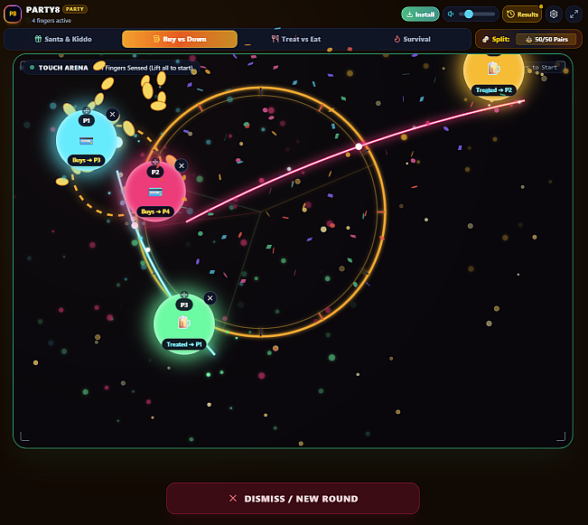

# ⚡ Party8

> A high-performance, multi-touch party decision app and random chooser featuring dynamic atmosphere themes, 60 FPS HTML5 canvas physics, procedural Web Audio acoustic synthesis, and themed game modes.

[Play Now.](https://grandsummoner.github.io/party8/party8.html)

---

## ✨ Features 

- 📱 **Hardware Multi-Touch**: Supports up to 8+ simultaneous fingers with real-time responsive particle halos and sound FX.
- 💻 **PC / Mouse Mode**: Tap anywhere or use the `+ Place Simulated Finger` and `⚡ Start Countdown` button to test or play with mice/trackpads.
- 🎁 **Santa & Kiddo Mode**: Santa places the first finger to register as the gift giver; remaining fingers represent the kids. When the timer pops, Santa's target kiddo is selected!
- 🍻 **Buy vs Down / Treat vs Eat**: Decide who pays the bill or who downs the drink with customized reveal roles.
- 👑 **Survivor & King of the Hill**: Elimination and crown modes for party showdowns.
- ⚡ **Audio Synthesizer Engine**: Built-in Web Audio synthesis delivering suspenseful countdown ticks, winner chimes, and tactile haptic feedback.
- 📴 **100% Offline & PWA Ready**: Install to your home screen or desktop with native fullscreen experience.

## 🕹️ Controls & Navigation

- Place Fingers: Everyone holds their finger on the screen within the arena.
- Trigger: Countdown starts automatically after 2+ fingers are placed (or click the start button in PC mode).
- Dismiss / Reset: Tap the Dismiss button at the bottom or click anywhere to start the next round.
- Settings (⚙️): Change game modes, countdown duration, sound themes, particle density, or force-refresh cache.
- History (📜): View results from previous rounds with timestamps.

## 📄 License
- MIT License. Free for personal, party, and commercial use.

---
